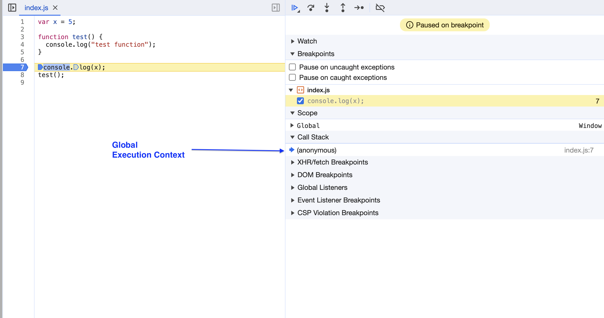
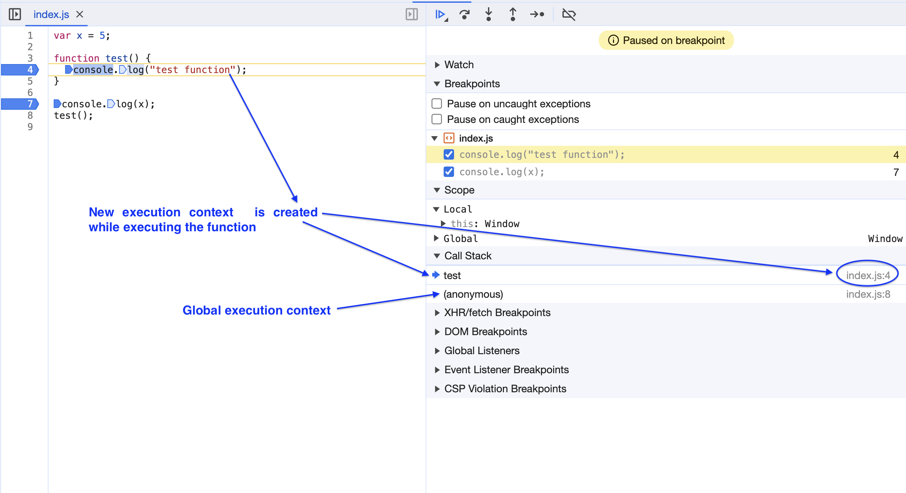
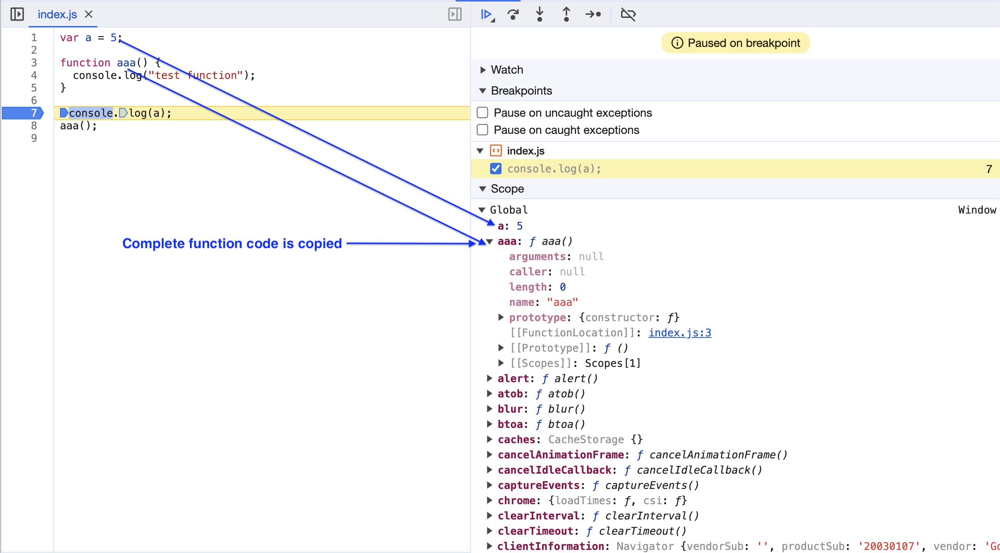
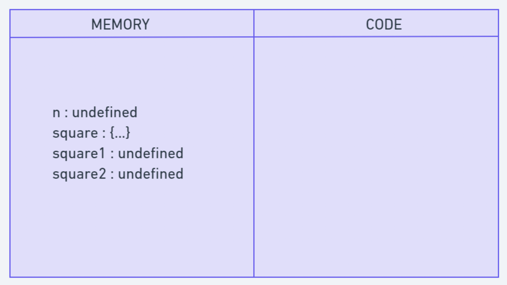
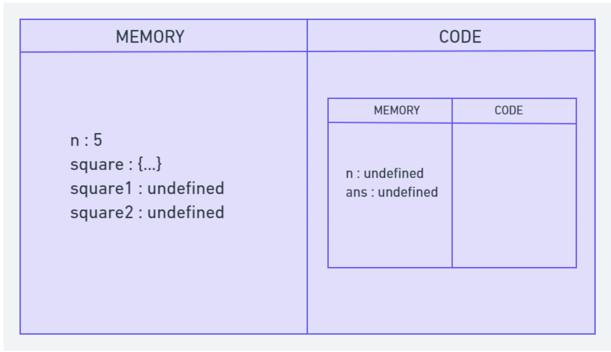
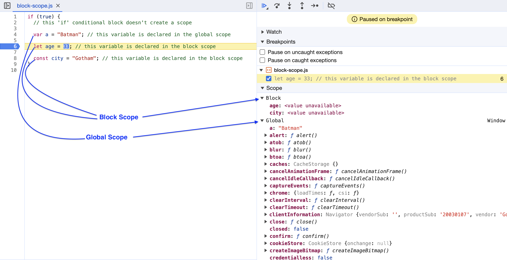
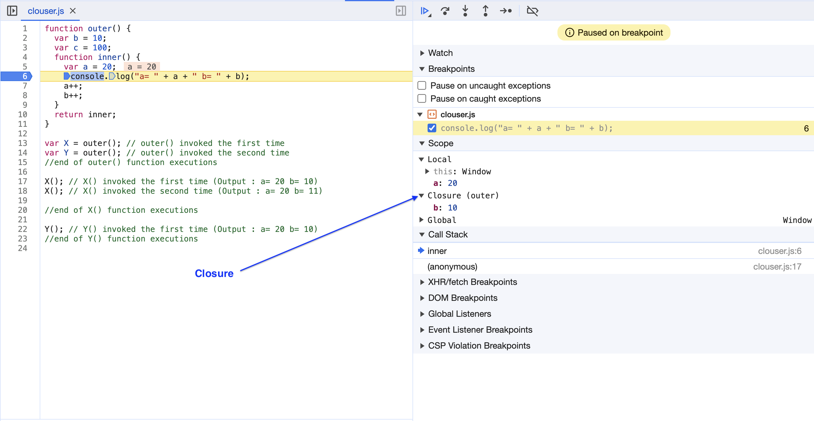

- [Execution Context](#execution-context)
  - [Types of Execution Context](#types-of-execution-context)
    - [Global Execution Context](#global-execution-context)
    - [Functional Execution Context](#functional-execution-context)
  - [Phases of Execution Context](#phases-of-execution-context)
    - [Creation Phase (Memory Creation phase)](#creation-phase-memory-creation-phase)
    - [Execution Phase](#execution-phase)
- [Hoisting](#hoisting)
  - [Variable hoisting with let and const](#variable-hoisting-with-let-and-const)
  - [Temporal dead zone (TDZ)](#temporal-dead-zone-tdz)
  - [Function hoisting](#function-hoisting)
    - [Function expressions](#function-expressions)
- [Call Stack](#call-stack)
- [Block Scope](#block-scope)
- [Lexical Environment](#lexical-environment)
- [Closures](#closures)
  - [Encapsulation](#encapsulation)


## Execution Context

Everything in JavaScript happens inside an execution context.

- The `execution context` is an environment in which JavaScript code is executed.
- When the JavaScript engine scans a script file, it makes an environment called the `Execution Context` that handles the entire transformation and execution of the code.
- During the context runtime, the parser parses the source code and allocates memory for the variables and functions

The execution context consists of two components:

- Memory Component (Variable environment)
- Code Component (Thread of Execution)

| Memory Component                        | Code Component                                                       |
| --------------------------------------- | -------------------------------------------------------------------- |
| Variables : undefined Functions : {...} | Each line of source code is executed line by line from top to bottom |

### Types of Execution Context

#### Global Execution Context

  - The global execution context is created when a JavaScript script first starts to run, and it represents the global scope in JavaScript.
  - The default execution context is the global execution context.
  - The global execution context is associated with the global object.
  - In the browser, the global object is the `window` object.
  - In Node.js, the global object is the `global` object itself.

  

#### Functional Execution Context

  - The functional execution context is created whenever the JavaScript engine enters a function invocation.
  - Each function invocation has its own execution context.
  - The functional execution context is associated with the function object that is invoked.



### Phases of Execution Context

#### Creation Phase (Memory Creation phase)

- The JavaScript engine creates the global object and the `this` object.
- The JavaScript engine also sets up memory space for variables and functions.



- During the creation phase, the JavaScript engine also parses the entire source code of the script and hoists all function declarations and variable declarations to the top of the current scope.

#### Execution Phase

- The JavaScript engine executes the code line by line.
- During the execution phase, the JavaScript engine assigns values to variables and executes code that is inside the function.
- When the JavaScript engine encounters a function invocation, it creates a `new execution context` for that function and executes the function body.

- Other Example

```js
function square(n) {
  var ans = n * n;
  return ans;
}
var square1 = square(n);
var square2 = square(8);

console.log(square1);
console.log(square2);
```

In the `Creation phase`, the JavaScript engine executes the entire source code, creates a global execution context, and then does the following things:

Creates a global object that is `window` in the browser and global in NodeJs. Sets up a memory for storing variables and functions. Stores the variables with values as undefined and function references.



In the `Execution Phase`, it starts going through the entire code line by line from top to bottom. As soon as it encounters n = 5, it assigns the value 5 to 'n' in memory. Until now, the value of 'n' was undefined by default.

Then we get to the 'square' function. As the function has been allocated in memory, it directly jumps into the line var square1 = square(n);. square() will be invoked and JavaScript once again will create a new function execution context.



Once the calculation is done, it assigns the value of square in the 'ans' variable that was undefined before. The function will return the value, and the function execution context will be destroyed.

## Hoisting

Hoisting is a JavaScript mechanism where variables and function declarations are moved to the top of their scope before code execution.

- In JavaScript, a variable can be declared after it has been used. In other words, a variable can be used before it has been declared.
- Hoisting is JavaScript's default behavior of moving all declarations to the top of the current scope (to the top of the current script or the current function).
- Hoisting is a JavaScript mechanism where variables and function declarations are moved to the top of their scope before code execution. 

```js
console.log(x === undefined); // true
var x = 3;
```

The above example is interpreted as follows:

```js
var x; // declaration
console.log(x === undefined); // true
x = 3; // initialization
```

Because of hoisting, JavaScript declarations can be used before they are declared.

In JavaScript, functions and variables are hoisted. Let's take a look at the following example:

```js
// Example 1
var x = 5; // Initialize x
var y = 7; // Initialize y

elem = document.getElementById("demo"); // Find an element
elem.innerHTML = x + " " + y; // Display x and y

// Example 2

var x = 5; // Initialize x

elem = document.getElementById("demo"); // Find an element

elem.innerHTML = x + " " + y; // Display x and y

var y = 7; // Initialize y
```

In the first example, `y` is declared after it is used. In the second example, `y` is declared before it is used.

The result of `y` in the first example will be:

```js
7;
```

The result of `y` in the second example will be:

```js
undefined;
```

It's kind of weird that JavaScript lets us access variables before they're declared. This behavior is an unusual part of JavaScript and can lead to errors. Using a variable before its declaration is usually not desirable.

### Variable hoisting with let and const

Variables declared with let and const are hoisted but not initialized with a default value. Accessing a let or const variable before it's declared will result in a `ReferenceError`:

```js
console.log(foo); // Uncaught ReferenceError: Cannot access 'foo' before initialization

let foo = "bar"; // Same behavior for variables declared with const
```

### Temporal dead zone (TDZ)

In above example, the reason that we get a `reference error` when we try to access a `let` or `const` variable before its declaration is because of the temporal dead zone (TDZ).

The time span between variable creation and initialization is called the temporal dead zone (TDZ). Accessing a variable in its TDZ will throw a `ReferenceError`

The TDZ starts at the beginning of the variable's enclosing scope and ends when it is declared. Accessing the variable in this TDZ throws a ReferenceError.

```js
{
  // Start of foo's TDZ
  let bar = "bar";
  console.log(bar); // "bar"

  console.log(foo); // ReferenceError because we're in the TDZ

  let foo = "foo"; // End of foo's TDZ
}
```

The TDZ is also present in default function parameters, which are evaluated left-to-right. In the following example, bar is in the TDZ until its default value is set:

```js
function foobar(foo = bar, bar = "bar") {
  console.log(foo);
}
foobar(); // Uncaught ReferenceError: Cannot access 'bar' before initialization
```

But this code works because we can access foo outside of its TDZ:

```js
function foobar(foo = "foo", bar = foo) {
  console.log(bar);
}
foobar(); // "foo"
```

### Function hoisting

Function declarations are hoisted, too. Function hoisting allows us to call a function before it is defined. For example, the following code runs successfully and outputs "foo":

```js
foo(); // "foo"

function foo() {
	console.log('foo');
}
```

#### Function expressions

Function expressions are not hoisted. For example, the following code throws a `TypeError`:

```js
foo(); // TypeError: foo is not a function

var foo = function() {
  console.log('foo');
}
```

## Call Stack

To keep the track of all the contexts, including global and functional, the JavaScript engine uses a call stack. A call stack is also known as an 'Execution Context Stack', 'Runtime Stack', or 'Machine Stack'.

It uses the LIFO principle (Last-In-First-Out). When the engine first starts executing the script, it creates a global context and pushes it on the stack. Whenever a function is invoked, similarly, the JS engine creates a function stack context for the function and pushes it to the top of the call stack and starts executing it.

## Block Scope

A block scope is the area within if, switch conditions or for and while loops. Generally speaking, whenever you see {curly brackets}, it is a block. 

In ES6, `const` and `let` keywords allow developers to declare variables in the block scope, which means those variables exist only within the corresponding block.

```js
if (true) {
  // this 'if' conditional block doesn't create a scope

  var a = "Batman"; // this variable is declared in the global scope

  let age = 33; // this variable is declared in the block scope

  const city = "Gotham"; // this variable is declared in the block scope
}

console.log(a); // "Batman"

console.log(age); // Uncaught ReferenceError: age is not defined

console.log(city); // Uncaught ReferenceError: city is not defined
```



In the above example, the `if` conditional block doesn't create a scope. The `var` variable `a` is declared in the global scope. The `let` and `const` variables `age` and `city` are declared in the block scope.

The `let` and `const` variables `age` and `city` are not accessible outside the block scope. If you try to access them outside the block scope, you will get a `ReferenceError`.

The `var` variable `a` is accessible outside the block scope. If you try to access it outside the block scope, you will get the value of `a`.


## Lexical Environment

A lexical environment is a place where variables and functions live or physically present during the program execution.

Lexical scope is the ability for a function scope to access variables from the parent scope

The lexical environment consists of two parts:

- Environment Record − It is a component of the lexical environment which stores all local variables as its properties (with their values being the variable's value).
- A reference to the outer lexical environment, the one associated with the outer   function in case of nested functions.


```js
function foo() {
  var myVar = "foo";
  console.log(myVar); // "foo"
}

function bar() {
  var myVar = "bar";
  console.log(myVar); // "bar"
  foo();
}

var myVar = "global";

console.log(myVar); // "global"

bar();
```

In the above example, the `global lexical environment` consists of two parts:

- Environment Record − It stores all global variables as its properties (with their values being the variable's value).
- A reference to the outer lexical environment, which is `null` in this case.


The `bar() function` has its own lexical environment, which consists of two parts:
- Environment Record − It stores all local variables as its properties (with their values being the variable's value).
- A reference to the outer lexical environment, which is the global lexical environment in this case.

The `foo() function` has its own lexical environment, which consists of two parts:
- Environment Record − It stores all local variables as its properties (with their values being the variable's value).
- A reference to the outer lexical environment, which is the lexical environment of the `bar()` function in this case.


The lexical environment of the `foo() function` is the inner lexical environment of the `bar() function`. 

The lexical environment of the `bar() function` is the inner lexical environment of the `global` lexical environment.

The lexical environment of the `global` lexical environment is `null`.

## Closures

Function along with its lexical scope is called a Closure

Here's a breakdown of the components:

`Function`: The inner function, which is defined within another function, is the core of the closure. This function can access its own parameters and variables, as well as those of the outer function.

`Lexical Scope`: The lexical scope refers to the environment in which a function is declared. When an inner function is defined within an outer function, it has access to the variables and parameters of that outer function, forming a closure.

A closure in JavaScript is created when a function is defined within another function, allowing the inner function to access the outer function's variables and parameters. 

In other words, a closure allows a function to retain access to the scope in which it was created, even after that scope has finished executing.

```js
function outer() {
  var b = 10;
  var c = 100;
  function inner() {
    var a = 20;
    console.log("a= " + a + " b= " + b);
    a++;
    b++;
  }
  return inner;
}

var X = outer(); // outer() invoked the first time
var Y = outer(); // outer() invoked the second time
//end of outer() function executions

X(); // X() invoked the first time (Output : a= 20 b= 10)
X(); // X() invoked the second time (Output : a= 20 b= 11)

//end of X() function executions

Y(); // Y() invoked the first time (Output : a= 20 b= 10)
//end of Y() function executions
```

In the above example, the `outer()` function has two local variables: `b` and `c`. The `inner()` function has one local variable: `a`.

The `outer()` function returns the `inner()` function. The `outer()` function is invoked two times. The first time it is invoked, the `outer()` function creates a new lexical environment, which consists of two parts:

- Environment Record − It stores all local variables as its properties (with their values being the variable's value).
- A reference to the outer lexical environment, which is the global lexical environment in this case.



### Encapsulation

`Closures` are powerful because they allow for the creation of private variables and encapsulation. They are commonly used in various JavaScript patterns, such as the module pattern and in asynchronous programming with callbacks.


```js
function createCounter() {
  let count = 0;

  return {
    increment: function() {
      count++;
    },
    decrement: function() {
      count--;
    },
    getCount: function() {
      return count;
    }
  };
}

let counter = createCounter();
counter.increment();
counter.increment();
console.log(counter.getCount()); // Outputs: 2
```

In this example, the count variable is encapsulated within the closure, and the returned object provides methods to interact with it while keeping it private from the external scope.


